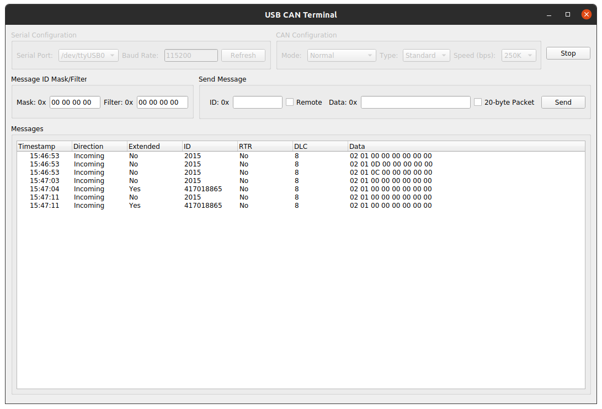

# USBCAN-GUI
This is a Linux-based GUI (shown below) to interact with the USB-CAN analyzer in order to send and receive packets over a CAN bus.

## Dependecies
The current library has two categories of dependency as follows:

### Hardware dependencies
- [USB-CAN Analyzer](https://github.com/SeeedDocument/USB-CAN-Analyzer)
- [CH341SER Linux Driver v1.3](https://github.com/SeeedDocument/USB-CAN-Analyzer/tree/master/res/Driver)

### Software dependencies
- Qt Creator 4.11.0
- Compiler:
    - Qt 5.12.8 (GCC 9.3.0, 64 bit)

## Documentation
[The definition of the serial (USB) conversion CAN protocol](https://github.com/SeeedDocument/USB-CAN-Analyzer/blob/master/res/Document/USB%20(Serial%20port)%20to%20CAN%20protocol%20defines.pdf)

## Acknowledgement
The configuration packet structure is inspired from [USB-CAN Analyzer Linux Support](https://github.com/kobolt/usb-can).
